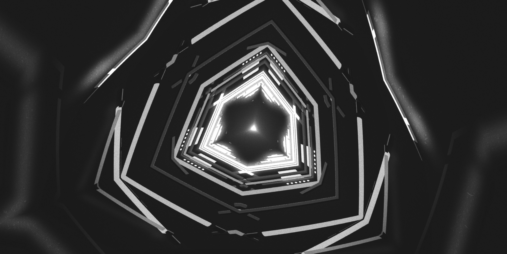
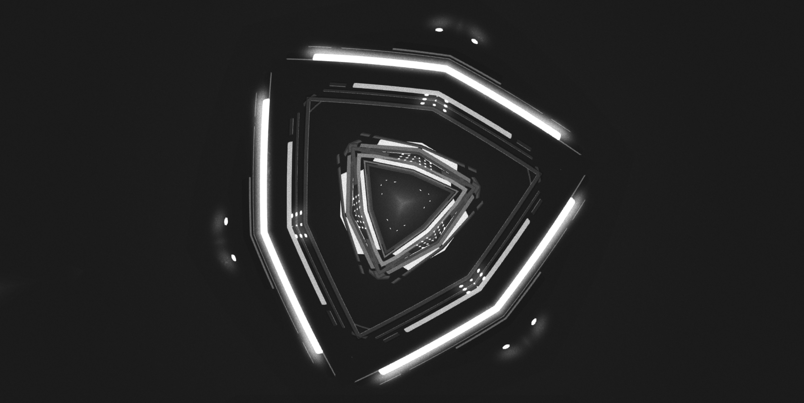

# RAYLIGHT

Experimental music visualizer.

#### Demo

http://raylight.surge.sh/

#### High Quality Settings

http://raylight.surge.sh/?highQuality

#### Screenshots

  

  

#### Credits

Designed & developed by Matt DesLauriers.

Music by Ukioau:  
https://soundcloud.com/ukiyoau/kaleidoscope

Dust & film noise texture:  
http://graphicburger.com/dust-noise-overlay-textures/

Original fog shader inspiration from Marcin Ignac:  
https://twitter.com/marcinignac/status/819977065751527424